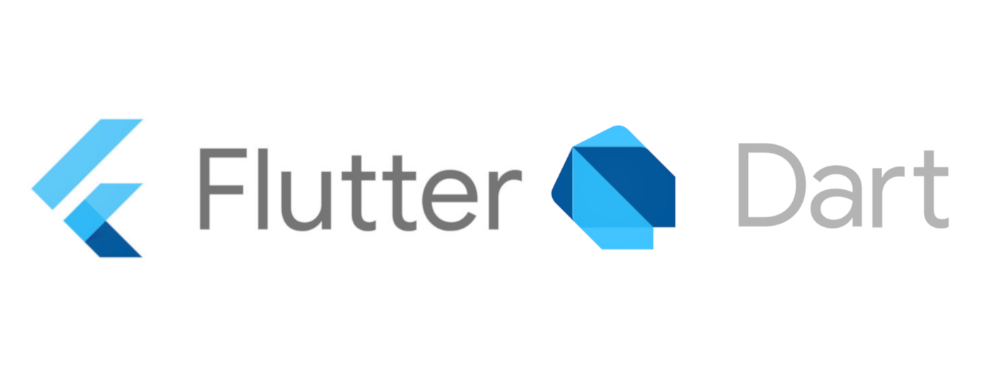

# Beginner Track For Hybrid App Development: Food Delivery App

## Information 
This is a food ordering & delivery application built with a flutter framework and firebase real-time database. 
Anyone can use this code for their own purpose. If you are interested in contributing to make this project then please follow [code-Style](codeStyle) and [Contribution steps](contribute).

## Installation

## Step to Contribute

## Code-Style

// make wiki guide page for dart code-style  

## Topics to cover
### programming language 
- [ ] dart  

### UI

- [ ] widgets
- [ ] assets
- [ ] static UI
- [ ] dynamic UI
- [ ] animations

### Storage 

- [ ] shared preference
- [ ] file system 
- [ ] SQLite 

### 3rd party libraries

- [ ] http
- [ ] cached_network_image
- [ ] SQLite
- [ ] Flutter_WebView_plugin
- [ ] Font_awesome_flutter

### Behavior Components

- [ ] permissions
- [ ] local notification
- [ ] push notification
- [ ] download manager 
- [ ] media 

### State Management 

- [ ] setState 
- [ ] Provider(beginner friendly)

### Firebase 
- [ ] Firebase Auth 
- [ ] Firebase Database(realtime & firestore)
- [ ] Firebase Storage 
- [ ] Firebase Messaging 

### Contributors

### Contact

Maintainer : sample@gmail.com

## LICENSE
Copyright (c) **GDSC Rait**. All rights reserved. Licensed under the MIT License

